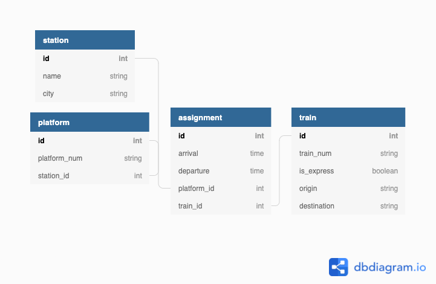

# Validations Station

You've been tasked with designing a system that will automate some operations for a railway system.  For each station in the system, your app will be able to assign incoming trains to a vacant platform, as well as publish the arrival and departure schedules for individual stations.

You'll be adding validations to the provided models as specified below using [ActiveRecord validation helpers](https://guides.rubyonrails.org/active_record_validations.html). There is also some seed data provided in `db/seeds.rb` to give you some data so you can test your models.

## Setup
- `rails db:migrate`
- `rails db:seed`
- `rails c`

Test your model validations in the console by trying to create model objects which deliberately violate your validations.

### `Station`
- must have a name
- name must be at least 3 characters long
- name must be unique

### `Platform`
- `platform_num` must be an integer
- `platform_num` must be in the range 1-20
- BONUS: `platform_num` must be unique to each station

## `Train`
- must have an origin and a destination
- origin and destination strings must be between 3 and 20 characters long, inclusive
- is_express must be a boolean

## `Assignment`
- must have arrival and departure times
BONUS:
- must arrive before it departs
- must not stay at platform for more than 20 minutes
- must only be assigned to a vacant platform (how could you acheive this with a combo of numericality validations with scope?)

